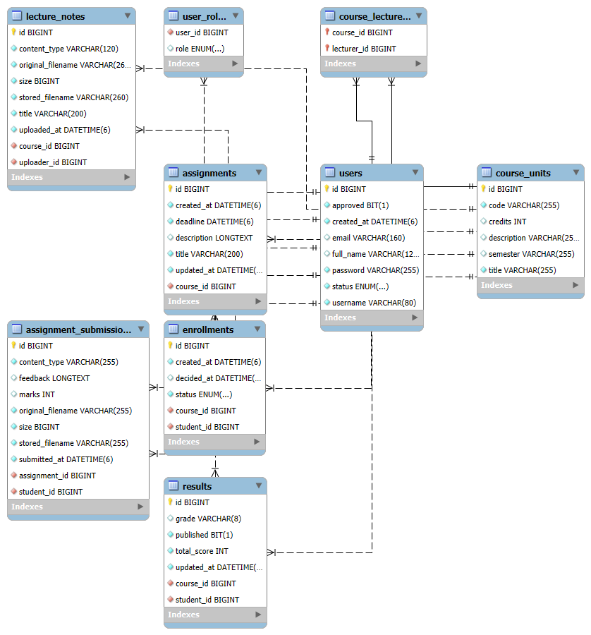

# 🎓 UCMS – University Course Management System

UCMS is a **full-stack course management platform** built to streamline teaching and learning in universities.  
It enables **Administrators, Lecturers, and Students** to collaborate on course creation, enrollment, assignments, lecture notes, and results.

---

## ✨ Features

### 👩‍🎓 Students
- Request enrollment into courses
- Access lecture notes
- Submit assignment answers
- View results and lecturer feedback

### 👨‍🏫 Lecturers
- Manage assigned courses
- Upload lecture notes
- Create and manage assignments
- Grade submissions and publish results

### 🛠️ Administrators
- Approve/reject user registrations
- Approve/reject course enrollments
- Assign lecturers to courses
- Generate detailed reports on users, courses, and results

---

## 🖼️ System Overview

### Database Design
The system follows a relational model linking **users, courses, enrollments, assignments, submissions, lecture notes, and results**.

---

## ⚙️ Tech Stack

- **Frontend:** Angular 16 + Angular Material, served with **Nginx**
- **Backend:** Spring Boot 3 (Java 17), Spring Security (JWT), Spring Data JPA
- **Database:** PostgreSQL 16
- **Build & Deploy:** Docker, Docker Compose

---

## ⚡ Project Setup

### 🔹 Prerequisites
Make sure you have installed:
- [Node.js](https://nodejs.org/) (v20+)
- [Angular CLI](https://angular.io/cli)
- [Java JDK](https://adoptium.net/) (17+)
- [Maven](https://maven.apache.org/) (3.9+)
- [Docker](https://docs.docker.com/get-docker/)

---
### 🔹 For Build

-  docker compose build 
-  docker-compose up --build

---
